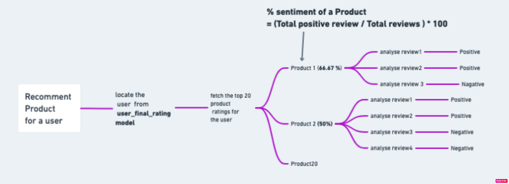

# Sentiment Based Product Recommendation

### Problem Statement

The e-commerce business is quite popular today. Here, you do not need to take orders by going to each customer. A company launches its website to sell the items to the end consumer, and customers can order the products that they require from the same website. Famous examples of such e-commerce companies are Amazon, Flipkart, Myntra, Paytm and Snapdeal.

 Suppose you are working as a Machine Learning Engineer in an e-commerce company named 'Ebuss'. Ebuss has captured a huge market share in many fields, and it sells the products in various categories such as household essentials, books, personal care products, medicines, cosmetic items, beauty products, electrical appliances, kitchen and dining products and health care products.

 With the advancement in technology, it is imperative for Ebuss to grow quickly in the e-commerce market to become a major leader in the market because it has to compete with the likes of Amazon, Flipkart, etc., which are already market leaders.

### Solution

* github link: https://github.com/davisvarkey/sentiment_based_product_recommendation

* Heroku (Application is Live): https://retail-product-recommend-app-f7d438c6b0fe.herokuapp.com

### Built with

Flask
nltk==3.9.1
numpy==2.0.2
pandas==2.2.2
gunicorn
scikit-learn==1.6.1

### Solution Approach

* Dataset and Attribute description are available under dataset\ folder
* Data Cleaning, Visualization and Text Preprocessing (NLP) are applied on the dataset. TF-IDF Vectorizer is used to vectorize the textual data(review_title+review_text). It measures the relative importance of the word w.r.to other documents
* Dataset suffers from Class Imbalance Issue and SMOTE Oversampling technique is used before applying the model
* Machine Learning Classification Models (Logistic Regression, Naive Baiyes, Tree Algorithms : (Decision Tree, Random Forrest, xgboost) are applied on the vectorized data and the target column (user_sentiment). the objective of this ML model is to classify the sentiment to positive(1) or negative(0). Best Model is selected based on the various ML classification metrics (Accuracy, Precision, Recall, F1 Score, AUC). Though xgboost is the bast performing model based on the evaluation metrics, its library takes more space which is not supported in free tier of heroku. hence the next best model Logistic Regression is selected.
* The system combines collaborative filtering recommendations with sentiment analysis.
*  \SentimentBasedProductRecommendation.ipynb Jupiter notebook contains the code for Sentiment Classification and Recommender Systems
*  Colloborative Filtering Recommender system is created based on User-user and item-item approaches.RMSE evaluation metric is used for the evaluation.
*  Top 20 products are filtered using the better recommender system, and for each of the products predicted the user_sentiment for all the reviews and filtered out the Top 5 products that have higher Postive User Sentiment (model.py)

*  Machine Learning models are saved in the pickle files(under the pickle\); Flask API (app.py) is used to interface and test the Machine Learning models. Bootstrap and Flask jinja templates (templates\index.html) are used for setting up the User interface. No additional Custom Styles used.
*  End to End application is deployed in Heroku 

Screenshots of the application posted below

